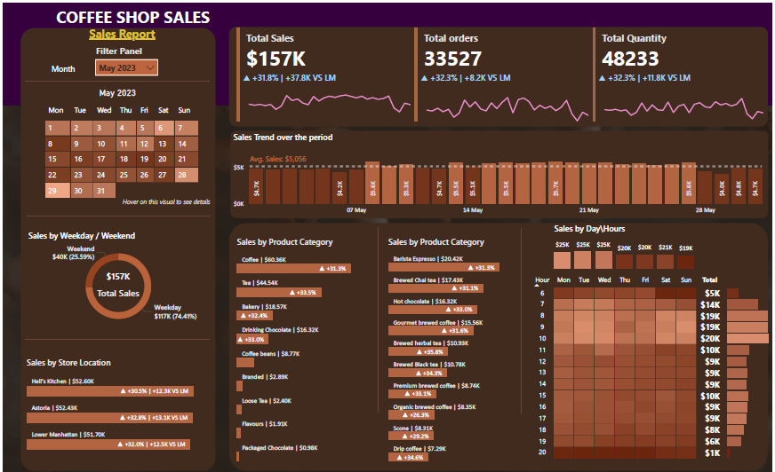

# ☕ Coffee Shop Sales Analysis Dashboard

## 📌 Project Overview
This project analyzes coffee shop sales data to uncover trends, track KPIs, and identify revenue growth opportunities.  
The dashboard was built to simulate a real-world business reporting scenario.

---

## 🎥 Dashboard Demo

  

---

## 📊 Dashboard Overview

  

---

## 🎯 Business Objectives
- Analyze monthly sales performance
- Calculate Month-over-Month (MoM) growth
- Identify top-performing products
- Track revenue and transaction trends

---

## 🛠 Tools Used
- Power BI  
- MySQL  
- Excel  

---

## 📈 Key Insights
- Sales show consistent upward growth trend.
- Peak revenue observed in high-footfall months.
- Beverage category contributes highest revenue share.
- MoM growth peaked during promotional periods.

---

## 🚀 Project Impact
This dashboard enables stakeholders to:
- Monitor performance in real time  
- Make data-driven decisions  
- Identify revenue optimization opportunities  

---

## 👤 Author
**Vikrant Shandil**  
Aspiring Data Analyst | Power BI | SQL | Business Intelligence
