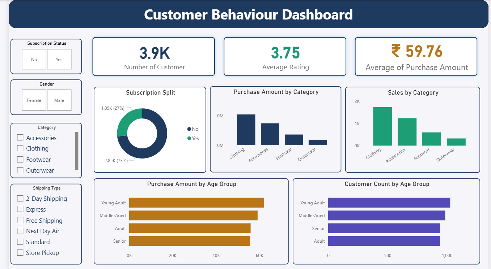

# 📊 Customer Behavior Analysis

## 📌 Overview

This project analyzes customer behavior to uncover trends, patterns, and actionable insights for better business decision-making.
It demonstrates an end-to-end analytics workflow using Python, MySQL, and Power BI.

---

## 📂 Dataset

The dataset includes customer-related data such as:

* Demographics
* Purchase Details
* Customer behaviour

It is used to analyze spending patterns, segmentation, and customer engagement.

---

## 🛠️ Tools & Technologies

* **Python (Pandas, NumPy)** – Data cleaning & EDA
* **MySQL** – Data querying & analysis
* **Power BI** – Dashboard & visualization

---

## 🔄 Project Workflow

### 1. Data Loading

* Imported dataset using Pandas
* Explored structure and data types

### 2. Exploratory Data Analysis (EDA)

* Identified trends and distributions
* Checked missing values and outliers

### 3. Data Cleaning

* Removed duplicates
* Handled null values
* Standardized formats

### 4. SQL Analysis

* Performed customer segmentation
* Calculated KPIs (Total Spend, Average Order Value, Purchase Frequency)
* Extracted insights using queries

### 5. Dashboard Development

* Built an interactive Power BI dashboard
* Added KPIs, filters, and trend visuals

---

## 📊 Dashboard Overview

<p align="center">
  
</p>

<p align="center">
  
</p>

<p align="center">
  
</p>

---

## ▶️ How to Run

1. **Clone the repository**

```bash
git clone https://github.com/your-username/customer-behavior-analysis.git
```

2. **Run Python Analysis**

```bash
!pip install pandas numpy 
```

3. **Run SQL Queries**

* Import dataset into MySQL
* Execute provided queries

4. **Open Dashboard**

* Open `.pbix` file in Power BI
* Refresh data if required

---

## 🚀 Key Outcomes

* End-to-end data analysis project
* Hands-on experience with Python, SQL, and Power BI
* Ability to convert raw data into actionable insights

