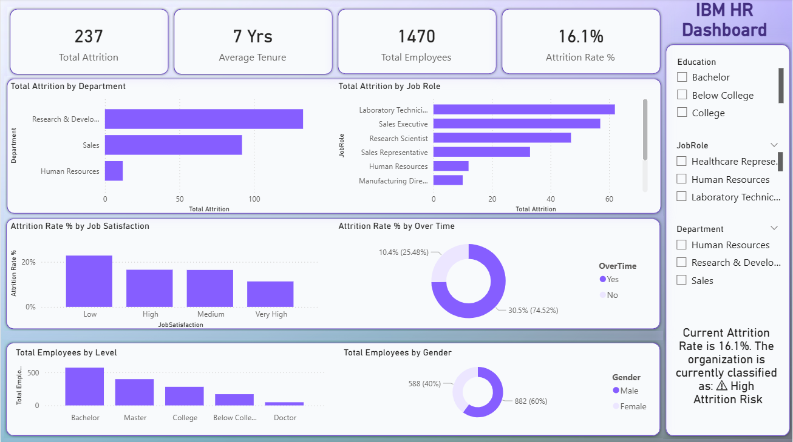
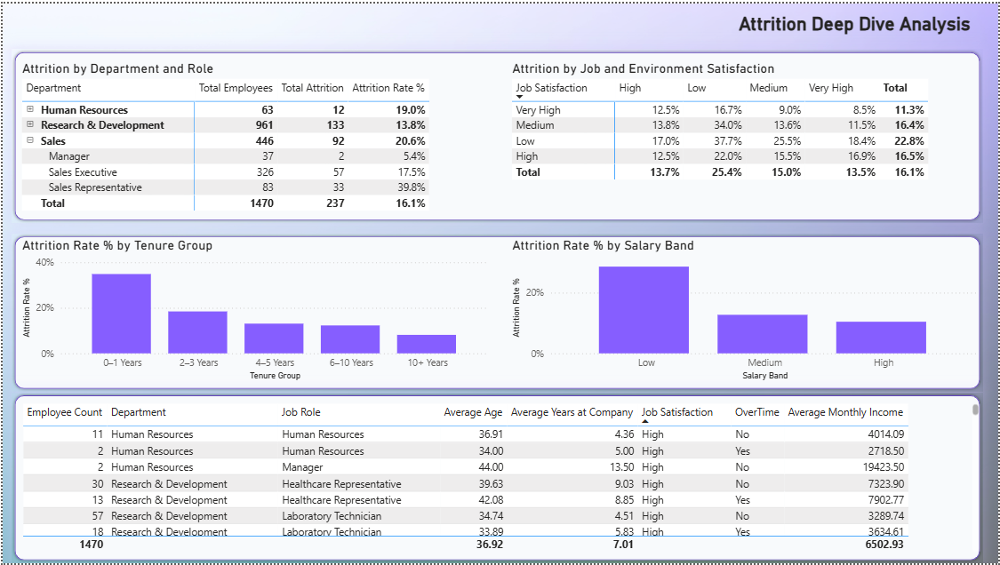

# 📊 IBM HR Analytics Dashboard

## 📌 Project Overview
This project analyzes the IBM HR dataset to uncover employee attrition trends, workforce patterns, and key HR performance indicators.  
The dashboard simulates a real-world HR analytics reporting scenario to support strategic HR decision-making.

---

## 🖼 Use Case

  

---

## 🎯 Business Objectives
- Analyze overall employee attrition rate  
- Identify high-risk departments and job roles  
- Study impact of overtime, salary, and job satisfaction  
- Track workforce distribution and performance metrics  

---

## 📊 Dashboard Overview

### 📄 Page 1 – Overview

  

### 📄 Page 2 – Analysis

  

---

## 🛠 Tools Used
- Power BI  
- DAX  
- Data Modeling  
- Excel  

---

## 📈 Key Insights
- Higher attrition observed among employees working overtime  
- Certain job roles show significantly higher turnover  
- Salary and job level influence employee retention  
- Younger workforce segments show higher mobility trends  

---

## 👤 Author
**Vikrant Shandil**  
MBA | CAPM Certified  
Aspiring Data Analyst | Power BI | SQL | Business Intelligence  
